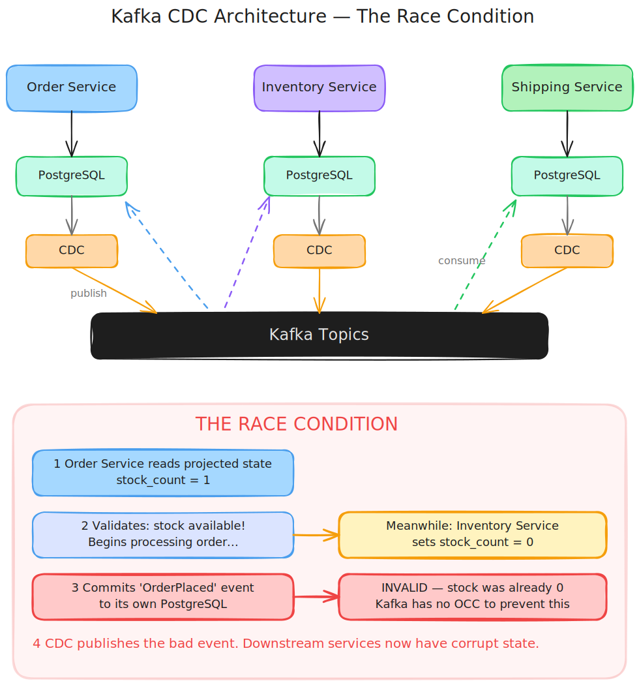
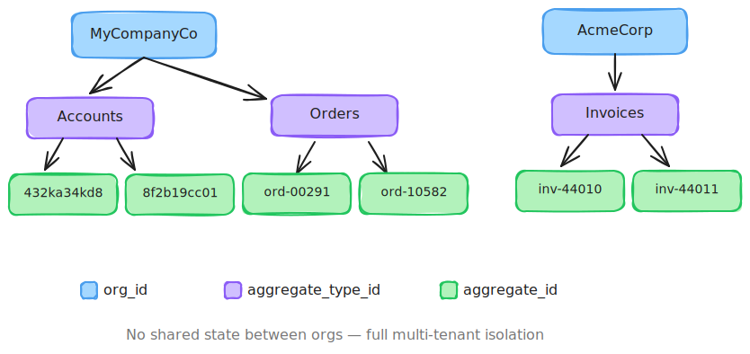

# Celeriant

A fast, distributed, append only write-ahead-log, built specifically for event-sourcing. It's dedicated to the write side of [CQRS](https://www.martinfowler.com/bliki/CQRS.html).

## Why Celeriant
Celeriant is an event store that lets you enforce business invariants at write time across multiple streams, without embedding a distributed transaction system into every service.

Celeriant prioritises correctness by default. Optimistic concurrency control, strict ordering of events, exactly once writes, schema validation, and cluster wide durability.

Scale as you grow. PostgreSQL gives you correctness but not throughput. Kafka gives you throughput but not correctness. Celeriant gives you both.

Simple to run. Two nodes. No zookeeper, no partition rebalancing or vacuum tuning. Bounded memory, regardless of aggregate or event counts. Celeriant plays nice in prod.

Durable writes, per-event encryption, and every event is linked to its predecessor via [Blake3](https://github.com/BLAKE3-team/BLAKE3) hash, creating an immutable audit chain.

## 'Hello World' write benchmark

- 32 core CPU, 1x nvme over PCIe5
- Single 'Hello World' event payload per acknowledged write
- Clients & Servers on localhost, kernel syscalls but no network hops

### Throughput benchmark - 25k open client connections
- Single Node: **350k writes/sec**, latency avg 68ms, p99 170ms
- Replicated Cluster: **190k writes/sec**, latency avg 125ms, p99 272ms

### Latency benchmark - 1000 open client connections
- Single Node: 50k writes/sec, **latency avg 20ms, p99 27ms**
- Replicated Cluster: 15k writes/sec, **latency avg 63ms, p99 ~88ms**

## Why Not xxx?

### PostgreSQL
It does all the things. You can design a single table that acts like a write-ahead-log (WAL) for your events. You can add indexes for aggregate id, event types. You can do conditional writes and multi-aggregate atomic commits.

PostgreSQL dies at scale. Event stores often form the backbone of microservices architectures. They get busy. You are looking at 10-20k writes/sec on a good day. Add row locking, index lookups on conditional writes, things get worse fast.

There is also [IOPS + vacuum pressure](https://frn.sh/bio/). Writes in PostgreSQL leave a lot of garbage lying around that needs to be cleaned up in the background.

I've personally worked with companies while at Thoughtworks that have hit this wall. It's real.

### Kafka
Teams reach for Kafka as the alternative. Microservices each have their own PostgreSQL instance, state+events are written to tables first atomically, and a CDC picks up events and publishes them over Kafka topics. Other services pull from the topics and update their state in their own DBs.

On the surface it fixes all the problems. Kafka can scale to millions of writes/sec. And each service has a DB where it can use transactions. All problems solved? Not quite :)

Things start unravelling quickly. Before a service can write events, it needs to run its validation routine. That validation often relies on state that is constructed from other services' events. So there is an issue. We can't commit that event unless we know our state hasn't changed under us while processing. Kafka is no help here - it does event streaming - it doesn't have conditional writes + [OCC](https://issues.apache.org/jira/browse/KAFKA-2260). There may be only a few milliseconds in play here, so these problems don't show up in testing. They show up under production workloads.

 

There is also no way to read events per-aggregate. You are stuck with this fire-hose of a Kafka topic. There's no give me all 'OrderPlaced' events on aggregate '123'. 

If there are problems with an aggregate, you need a dead-letter queue (DLQ). Onboarding new services is difficult - Kafka removes old events from topics after a week.

Event ordering seems solved with a message key. But when you re-partition the Kafka cluster, the ordering gets messed up. It's terrifying so nobody does it. So you can't scale as you grow.

Kafka also has the schema registry ([which is not really open source](https://www.confluent.io/confluent-community-license-faq/)) - you can validate your event structures. But the [broker side validation is Confluent enterprise only](https://docs.confluent.io/platform/current/schema-registry/schema-validation.html#license) - critical to guarantee events always conform to the right schema.

Teams end up with a lot of crazy code to handle the sharp edges. It performs at scale, but you give up critical event sourcing functionality that should be built in.

## Core Celeriant Features

- Written in Rust. Linux only. Clients communicate over TCP connections.
- Thread-per-core architecture for low latency, high throughput. Inspired by [ScyllaDB](https://www.scylladb.com/) and [TigerBeetle](https://tigerbeetle.com/).
- Two node cluster with [S3 conditional writes](https://aws.amazon.com/about-aws/whats-new/2024/08/amazon-s3-conditional-writes/) for leader lease arbitration.
- No cardinality constraints. Store millions of aggregates, billions of events on a 32GB RAM server
- Dynamic consistency boundaries + per-aggregate ordering. Conditionally, atomically write events to multiple aggregates.
- Schema validation for event types, semantic versioning built in.
- Exactly-once guarantees for clients writing events
- Per-aggregate read, explicit offset controls, event type filtering built in
- Live watch API. React instantly to updates for real-time processing between systems.
- Aggregate listing & discovery, org-level watch API
- Per-event encryption support with AES-GCM.

## Architecture

### Aggregate Structure

    org_id / aggregate_type_id / aggregate_id

Multi-tenant ready, aggregates grouped by organisations. No shared state between orgs. 

Each aggregate belongs to a type, eg:

    MyCompanyCo -> Accounts -> 432ka34kd8

Ordering is guaranteed *within* a shard. Aggregates are assigned a shard deterministically - by aggregate id, type or org id - configured on the server.

 

### Durability Guarantees

Events are batched and written durably to disk on the leader. The leader then replicates the batch to the follower which also does a durable write. After confirming the replication, the leader acks back to clients. Celeriant is designed to never lose acknowledged writes.

Celeriant uses Direct I/O. It skips the Linux kernel page cache, which has issues with reporting fsync issues. Many databases skip Direct I/O - but buffered I/O through the kernel page cache is vulnerable to [silent data loss on fsync failure](https://lwn.net/Articles/752063/).

Fsync and replication are expensive, so Celeriant amortises this cost via batching. Thread-per-core simplifies this, most databases that run on thread pools have tricky concurrency and locking issues, but Celeriant avoids these classes of bugs entirely.

### Cluster Replication

Celeriant runs a simple two node cluster. Leader accepts writes, replicates to the follower. If a node goes down, data is backed up to S3 instead. Leader election also goes through S3.

The cluster is highly available. Zero downtime upgrades. No split-brain, no lost data.

Rolling upgrades work by shutting down one node at a time, the cluster fails over, the restarting node catches up automatically and rejoins.

 

### Memory & Indexing Design

The storage engine is designed for very high stream cardinality without index amplification. It uses bloom filters and falls back to reverse-wal scanning, with hot data in memory in a least-recently-used (LRU) cache.

Bloom filters and LRU caches ensure we never run out of RAM, no matter how many aggregates and events the server has. Writes and reads are always fast, the only trade off being slightly higher latency for reads on cold aggregates.

Most databases hit memory issues at high cardinality. Not Celeriant. This means you can model:

- One stream per user
- One stream per device
- One stream per game match
- One stream per order
- One stream per anything

Without worrying about whether your infrastructure will fall over.

## Why Not Celeriant

Celeriant fundamentally is a CQRS model - which trades immediate consistency of the read model for the ability to split writes and the projected system state. If your system can't tolerate an eventually consistent read model, you should opt for PostgreSQL or another RDBMS.

Celeriant being a write model, doesn't provide SQL query support. The primary read pattern is to provide an offset index for an aggregate, and a set of event types to filter by.

Kafka can still be used and is encouraged for event streaming purposes. This is when you don't need OCC, and systems don't rely on common state for their invariants.

# Current State

80% done. Last 3 years saw many prototypes, started as a C#/.net project, later moving to rust. Latest iteration started ~7 months ago -> looking to finish and release mid 2026 latest. 

It's in a state where it can be used in non-prod for pilot projects. But there are still some missing features:

- WAL compaction
- mTLS & oAuth
- Event type schema validation

And plenty of docs to write.

# Licensing

The plan is to release as Apache 2.0. The OSS version should be fully functional, I don't want to ship a broken OSS core product.

# Who

Celeriant is being built by [Tyson Brown](https://www.linkedin.com/in/tyson-brown-208b88b6/). 20yrs XP in enterprise, high performance systems. Based in Australia, currently a Lead Consultant at Thoughtworks.

